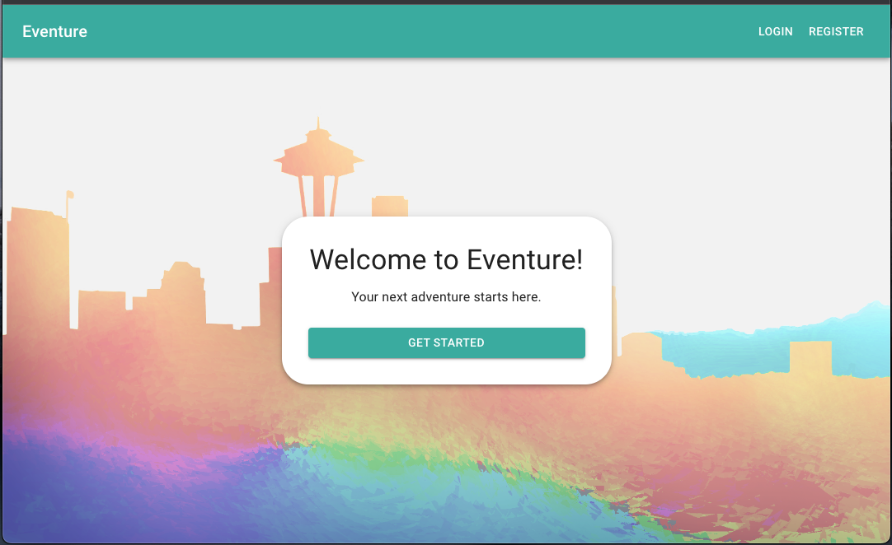

# Eventure (MERN application)

## Description
Eventure is a mulit-city event planning and discovery website, designed to ignite your passion for exploration and adventure. With a curated selection of happenings accross 4 unique cities (Seattle, WA | New York, NY | Los Angeles, CA | Miami, FL), it seamlessly connects you to captivating experiences. Whether you seek concerts, social gatherings, or art exhibitions, Eventure guides you towards memorable encounters, making your journey truly unforgettable. This is the [new release](https://eventure-plus-305de46556b9.herokuapp.com/) of our original [Eventure app](https://eventure.herokuapp.com/) | [Github](https://github.com/johnpow/eventure), but now using the GraphQL API built with Apollo Server and MERN stack (MongoDB, Express.js, React, Node.js).

## Table of Contents
- [Usage](#usage)
- [Credits](#credits)
- [Features](#features)
- [Technology Used](#tech)
- [Access](#access)

## Usage
- To use the site you will need to go to the [Eventure](https://eventure-plus-305de46556b9.herokuapp.com/) and create an account!
- You can then explore the various events in your area by topic
- If you want to join, you click the sign-up icon
- If plans change, you can always "Drop Event" by re-clicking the signup icon
- Leave comments and engage with other Eventurers! 
- You can create your own event and get others to join you

## Technology Used
Eventure is built using the following technologies:

- *Front-end*:
  - React: A JavaScript library for building user interfaces.
  - Apollo Client: A fully-featured, production-ready caching GraphQL client for React.
  - HTML/CSS: For structuring and styling the user interface.
  - Material-UI: A popular React UI framework that provides pre-built components and styles for creating modern and responsive user interfaces.

- *Back-end*:
  - Node.js: A server-side JavaScript runtime environment.
  - Express.js: A fast and minimalist web application framework for Node.js.
  - MongoDB: A NoSQL database used for storing event and user data.
  - GraphQL: A query language for APIs that enables more efficient data retrieval.
  - Apollo Server: A GraphQL server that connects to the MongoDB database.

- *Deployment*:
  - Heroku: A cloud platform used to deploy and host the application.

- *Version Control*:
  - Git: A distributed version control system for tracking changes in the code.

The use of the MERN stack (MongoDB, Express.js, React, Node.js) in combination with Apollo Server and GraphQL enables Eventure to provide a seamless and dynamic user experience, allowing users to easily discover and engage with various events in different cities.

Please note that the application's architecture and technologies may evolve over time as it continues to grow and improve.

If you have any further questions or need more details, feel free to reach out!

## Credits
This was a group effort of [@johnpow](https://github.com/johnpow), [@Arbitrary_Stag](https://github.com/Arbitrary-Stag), and [@saritha2708](https://github.com/saritha2708). It was a continuation of our original [Eventure app](https://eventure.herokuapp.com/) | [Github](https://github.com/johnpow/eventure) , built using new technology. 

## Features
- Secure User Registration / Login
- Browse events by topic in your area
- Sign up for events you're interested in
- User profiles and specific category filtering (Category and Location)
- Easily cancel participation with the uncheck option
- Organize and invite others to your own events
- Leave comments and communicate with other Eventurers! 

## Access
[Click to View Repository](https://github.com/johnpow/eventure-plus)

[Click for the Live Project](https://eventure-plus-305de46556b9.herokuapp.com/)

[Video Demo Link](https://drive.google.com/file/d/191xIH6JHY_l3xdmr7V9RSJ6Z-oLxmGKK/view)
